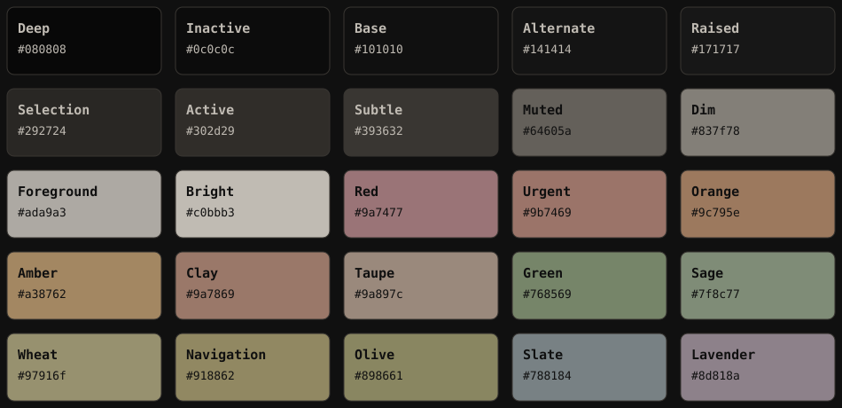

# Limei



Limei is a muted, low-contrast dark palette created by **harunnoir** for
terminals, editors, Linux ricing, GTK/Qt interfaces, and long sessions.

Its identity is defined by **25 immutable canonical colors**. Compatibility
mappings and derived colors are generated around those values without replacing
or redefining them.

Limei is not a single-green theme. Sage, clay, taupe, wheat, amber, olive,
slate, lavender, red, and neutral shades should be distributed by semantic role
while keeping the result cohesive and restrained.

## Color layers

```text
Canonical Limei 25
├── official ANSI 16 mapping
├── terminal special colors
├── fixed xterm-256 nearest-index mapping
├── derived alpha/ramps/gradients
└── software ports
```

- **Canonical:** immutable names and hex values.
- **Mappings:** compatibility selections from canonical colors.
- **Derived:** generated extensions, always marked non-canonical.
- **Ports:** application-specific use of canonical and documented derived values.

Read [`palette/README.md`](./palette/README.md) and
[`docs/ARCHITECTURE.md`](./docs/ARCHITECTURE.md) for details.

## Repository structure

```text
Limei/
├── assets/
├── docs/
├── palette/
│   ├── canonical/
│   ├── mappings/
│   └── derived/
├── ports/
├── scripts/
├── templates/
├── LICENSES/
├── CHANGELOG.md
├── PORTING.md
└── README.md
```

## Included ports

| Software | Location |
|---|---|
| Foot | `ports/terminals/foot/` |
| Alacritty | `ports/terminals/alacritty/` |
| Kitty | `ports/terminals/kitty/` |
| WezTerm | `ports/terminals/wezterm/` |
| Ghostty | `ports/terminals/ghostty/` |
| Konsole | `ports/terminals/konsole/` |
| Xresources | `ports/terminals/xresources/` |
| Windows Terminal | `ports/terminals/windows-terminal/` |
| tmux | `ports/shell/tmux/` |
| fzf | `ports/shell/fzf/` |
| Starship | `ports/shell/starship/` |
| Zellij | `ports/shell/zellij/` |
| Bash variables | `ports/shell/bash/` |
| Niri | `ports/desktop/niri/` |
| Waybar | `ports/desktop/waybar/` |
| Mako | `ports/desktop/mako/` |
| SwayNC | `ports/desktop/swaync/` |
| Rofi | `ports/desktop/rofi/` |
| Wofi | `ports/desktop/wofi/` |
| GTK named colors | `ports/desktop/gtk/` |
| Qt QSS | `ports/desktop/qt/` |
| Hyprland | `ports/desktop/hyprland/` |
| Zathura | `ports/apps/zathura/` |
| Sioyek | `ports/apps/sioyek/` |
| btop | `ports/apps/btop/` |
| Helix | `ports/apps/helix/` |
| git-delta | `ports/apps/git-delta/` |
| Lazygit | `ports/apps/lazygit/` |
| Chromium/Helium | `ports/apps/chromium/` |

## Comfort and semantic use

Using Limei correctly means more than copying its hex values. Read [`docs/COMFORT-GUIDELINES.md`](./docs/COMFORT-GUIDELINES.md) for the official rules governing surface area, persistence, frequency, focus, selection, semantic states, and accent balance.

The v1.0.1 review covers every included port. See [`docs/COMFORT-AUDIT.md`](./docs/COMFORT-AUDIT.md) and the composite [visual demo](./tests/visual-demo/limei-contexts.svg).

## Generate and validate

Regenerate all owned outputs:

```bash
python3 scripts/generate.py
```

Run every repository check:

```bash
./scripts/validate.sh
```

The validation suite checks:

- the immutable canonical hash and ordered color list;
- generated-file reproducibility;
- official ANSI consistency across terminal ports;
- canonical RGB use, including decimal RGB formats;
- attribution and SPDX headers;
- JSON, TOML, YAML, and shell syntax;
- role-aware contrast reporting;
- semantic comfort and role validation;
- basic documentation formatting.

## Quick terminal setup

### Foot

```bash
mkdir -p ~/.config/foot/themes
cp ports/terminals/foot/limei.ini ~/.config/foot/themes/
```

Add to `~/.config/foot/foot.ini`:

```ini
include=~/.config/foot/themes/limei.ini
```

### Alacritty

```bash
mkdir -p ~/.config/alacritty/themes
cp ports/terminals/alacritty/limei.toml ~/.config/alacritty/themes/
```

Import it from `~/.config/alacritty/alacritty.toml`:

```toml
[general]
import = ["~/.config/alacritty/themes/limei.toml"]
```

### Kitty

```bash
mkdir -p ~/.config/kitty/themes
cp ports/terminals/kitty/limei.conf ~/.config/kitty/themes/
printf '
include themes/limei.conf
' >> ~/.config/kitty/kitty.conf
```

## Design rules

1. Keep neutral surfaces and text dominant.
2. Use the whole accent palette in balance.
3. Do not make every active element sage.
4. Reserve red for errors and destructive actions.
5. Use amber for warnings and slate for information.
6. Use clay, taupe, wheat, olive, and lavender for secondary distinctions.
7. Avoid rainbow-like layouts; color should clarify hierarchy.
8. Preserve long-session comfort over decoration.

## Attribution

Public ports and adaptations must retain visible credit:

```text
Colors based on the Limei palette by harunnoir.
```

See [`NOTICE.md`](./NOTICE.md) for the preferred complete wording.

## Licensing

- Palette, names, documentation, and visual assets: **CC BY-SA 4.0**
- Configuration ports, scripts, and reusable code: **GPL-3.0-or-later**

See [`LICENSE.md`](./LICENSE.md) and [`LICENSES/`](./LICENSES/).

Copyright © 2026 harunnoir.
